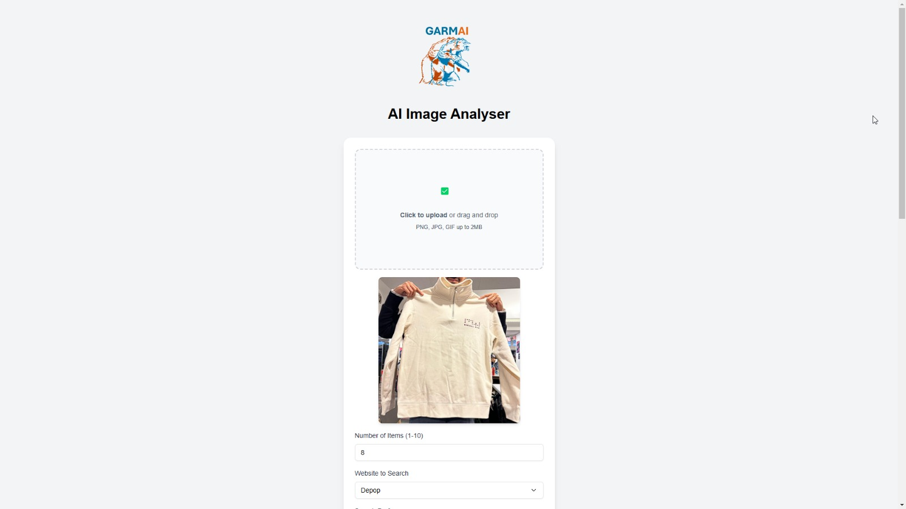
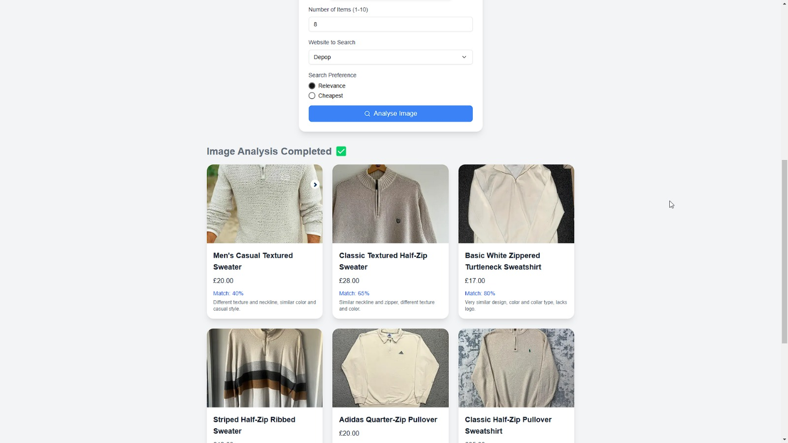
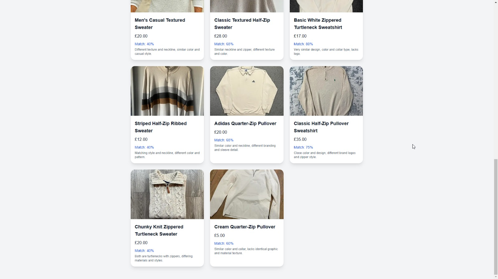
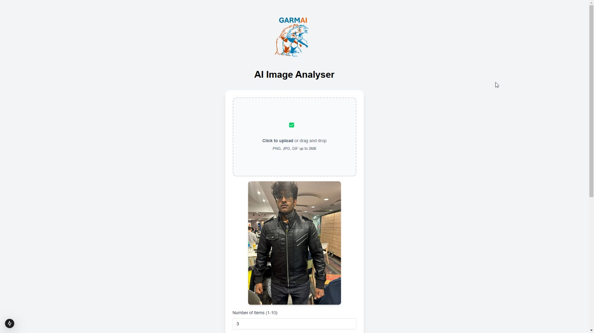
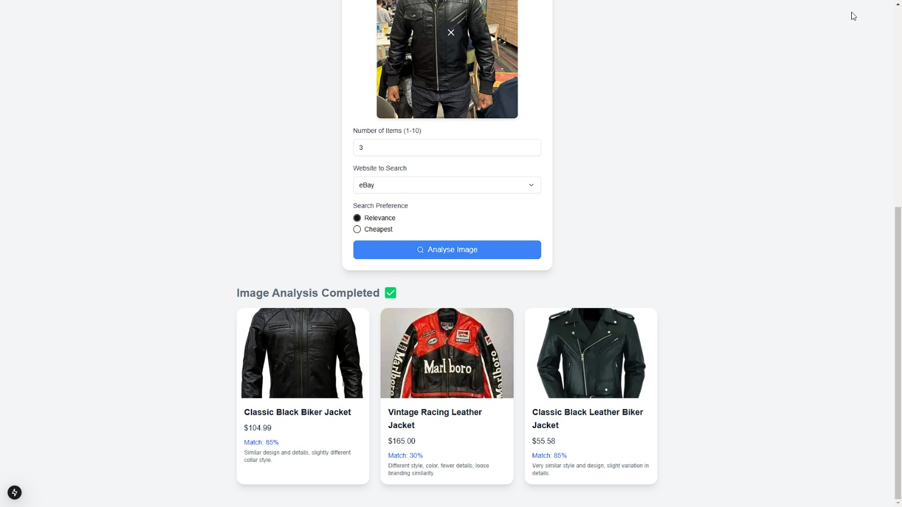

# Clothing Search Automation

Conceptualised and implemented in under 24 hours at ICHack 25 @ Imperial College London.

## Getting Started

`npm install` to install all dependencies.

`npm run dev` to start the server.

`npm run build` to build the project, and then `npm start` to start the server.

## Proof of Concept
This application automates online clothing searches by analysing a user-supplied image and returning the most similar clothing item found. It utilises state-of-the-art browser AI agents to ensure deterministic outputs and realistic results.

### Key Features
- AI-driven search automation: Uses GPT-4 models for image-to-text generation, search automation, and similarity scoring.
- Multi-platform support: Searches across marketplaces like Depop and eBay.
- Optimized frontend & backend: Built with TypeScript, Next.js, Python, OpenAI API, Stagehand, and Tailwind CSS.

### Screenshots
Example 1 with eight items, searching on Depop:

Example 2 with three items, searching on eBay:

## Hosted at [this link](https://mirasv.com)

(as of February 5, 2025). Availability may change.

### Note

This project showcases the versatility of AI agents in automating repetitive and relatively simple human tasks. The fundamentals of AI agents can be applied to similar problems across industries, and we anticipate a widespread evolution in such use cases.
